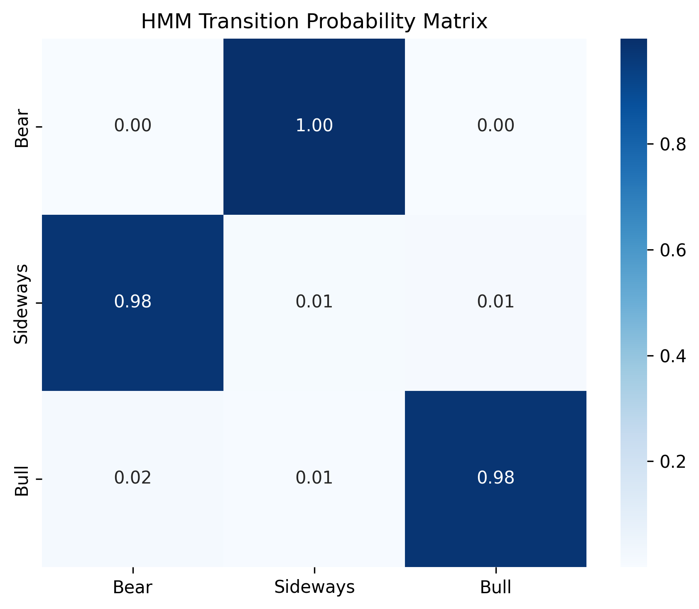

# Market Regime Detection System

## Overview

Financial markets do not behave uniformly over time. Instead, they cycle through **distinct regimes** characterized by different volatility, momentum, and return behavior.

This project builds an **unsupervised machine learning pipeline** to detect **market regimes** in the S&P 500 ETF (**SPY**) using historical price data from **2005–present**.

The system identifies three primary regimes:

- **Bull** - trending upward markets  
- **Bear** - declining markets  
- **Sideways** - range-bound or uncertain markets  

Two models are implemented and compared:

- **KMeans Clustering** (primary model)
- **Gaussian Hidden Markov Model (HMM)** (comparison model)

---

# Dataset

- **Asset:** SPY (S&P 500 ETF)  
- **Source:** Yahoo Finance (`yfinance`)  
- **Frequency:** Daily  
- **Start Date:** 2005  
- **Observations:** ~5,277 trading days (after rolling window computation)

SPY is used as a proxy for the **broader U.S. equity market**, capturing major events such as:

- 2008 Global Financial Crisis  
- 2020 COVID crash  
- 2022 rate-hike selloff  

---

# Feature Engineering

Four domain-motivated features are used to characterize market behavior.

| Feature | Description |
|------|------|
| Rolling Volatility (20d) | Risk proxy capturing volatility clustering |
| SMA Ratio (20/50) | Trend indicator |
| RSI (14) | Momentum oscillator |
| Log Return (5d) | Short-term directional signal |

All features are **standardized using StandardScaler** before clustering.

> **Note on look-ahead bias:** The scaler is currently fit on the full dataset. A production system would use walk-forward fitting - noted as a future improvement.

---

# Model Methodology

## KMeans Clustering

KMeans is used as the **primary model** due to cleaner 3-regime separation with a 4-feature observation space.

Since cluster labels are arbitrary, regimes are assigned **post-clustering** based on **mean return ranking**:
```
Lowest mean return  → Bear
Middle mean return  → Sideways
Highest mean return → Bull
```

---

## Hidden Markov Model (HMM)

A **Gaussian HMM** captures **temporal dependence between regimes** - unlike KMeans, which treats each day independently, HMM models the probability of transitioning between states.

Observation space:
```
[log_return, rolling_volatility]
```

HMM was implemented alongside KMeans for comparison. KMeans was selected as the primary model because its 4-feature observation space produced cleaner 3-regime separation. The HMM transition matrix revealed Bear and Sideways collapsing into a two-state cycle, likely due to the limited 2-feature input. Expanding the observation space with VIX or yield curve data is the natural next step.

### Why HMM for Market Regimes?

Traditional clustering (KMeans) treats each trading day as **independent** 
it has no memory of what regime yesterday was in. This is unrealistic. 
Bear markets don't last one day; bull runs persist for months or years.

HMM addresses this by modeling **regime persistence and transitions explicitly**:
- A state can only change based on learned transition probabilities
- The model learns that Bull regimes are sticky (0.98 self-transition)
- Regime changes require sustained shifts in market behavior, not just a single day's readings

This makes HMM the **theoretically correct** model for financial regime detection
markets are sequential processes, not independent daily draws.

In this implementation, KMeans was selected as the primary model due to its 
richer 4-feature observation space producing cleaner separation. With VIX and 
yield curve features added to the HMM observation space, HMM would likely 
become the stronger model.

---

# Choosing the Number of Clusters

Two techniques were used to justify **k = 3**.

## Elbow Curve

<p align="center">
  
</p>

The elbow method shows diminishing returns in inertia reduction beyond **k = 3**.

---

## Silhouette Analysis

<p align="center">
  
</p>

Silhouette scores were evaluated for **k = 2–6**.

The highest score occurred at **k = 3 (~0.37)**, indicating the best balance between cluster cohesion and separation.

---

# Market Regime Detection (KMeans)

<p align="center">
  
</p>

The regime visualization highlights key historical periods:

- **2008 Financial Crisis → Bear**
- **2013–2019 → Bull**
- **2020 COVID crash → Bear**
- **2022 Rate Hike Selloff → Bear**

---

# HMM Transition Matrix

<p align="center">
  
</p>

Key observations from the transition matrix:

- **Bull → Bull: 0.98** - Bull regime is highly persistent. Once the market trends upward, it strongly maintains that state.
- **Bear → Sideways: 1.00** - Bear regime always transitions to Sideways, never directly to Bull. Consistent with real market behavior - recoveries don't happen overnight.
- **Sideways → Bear: 0.98** - With only 2 observation features, HMM conflates Bear and Sideways into a two-state cycle. Expanding the observation space with VIX or yield curve data would improve separation.

---

# Model Selection: KMeans vs HMM

| Criterion | KMeans | HMM |
|---|---|---|
| Observation features | 4 | 2 |
| Regime separation | Clean 3-way split | Bear/Sideways collapse |
| Temporal modeling | None | Transition probabilities |
| Interpretability | High | Medium |
| Primary model | ✅ | Comparison |

HMM is theoretically superior for sequential financial data. In this implementation, KMeans outperformed due to a richer feature set. With macro features added, HMM would likely produce more stable separation.

---

# Project Structure
```
market-regime-detection
│
├── src
│   ├── data.py
│   ├── features.py
│   ├── model.py
│   ├── train.py
│   └── visualize.py
│
├── notebooks
│   ├── 01_eda_preprocessing.ipynb
│   └── 02_model_training.ipynb
│
├── models
│   ├── kmeans_model.pkl
│   ├── hmm_model.pkl
│   └── scaler.pkl
│
├── outputs
│   ├── elbow_curve.png
│   ├── silhouette_scores.png
│   ├── regime_map.png
│   ├── hmm_transition_matrix.png
│   └── regime_results.csv
│
├── config.py
├── requirements.txt
└── README.md
```

---

# How to Run

### Install dependencies
```
pip install -r requirements.txt
```

### Train models
```
python -m src.train
```

### Explore notebooks
```
notebooks/01_eda_preprocessing.ipynb
notebooks/02_model_training.ipynb
```

---

# Key Takeaways

- Market regimes can be identified using **unsupervised learning** on technical indicators
- Volatility and momentum features strongly separate Bull from Bear/Sideways periods
- **KMeans with 4 features** produced cleaner regime separation than HMM with 2 features
- **HMM transition matrix confirms Bull persistence (0.98)** - consistent with real market dynamics
- Both models correctly identify the 2008 GFC and 2020 COVID crash as Bear regimes

---

# Future Improvements

- **Expand HMM observation space** - add VIX and yield curve features (available via yfinance) to improve Bear/Sideways separation
- **Walk-forward training** - fit scaler and models on rolling historical windows to eliminate look-ahead bias
- **Hidden Semi-Markov Models (HSMM)** - model regime duration explicitly
- **Regime-based portfolio allocation** - use detected regimes to dynamically adjust exposure or risk levels
- **Incorporate macroeconomic indicators** - credit spreads, interest rates for broader market context

---

# Technologies Used

- Python · Scikit-Learn · hmmlearn · Pandas · NumPy · Matplotlib · Plotly · yfinance

---

# Author

Disha Patel  
Computer Science Student | Machine Learning & Quant Finance