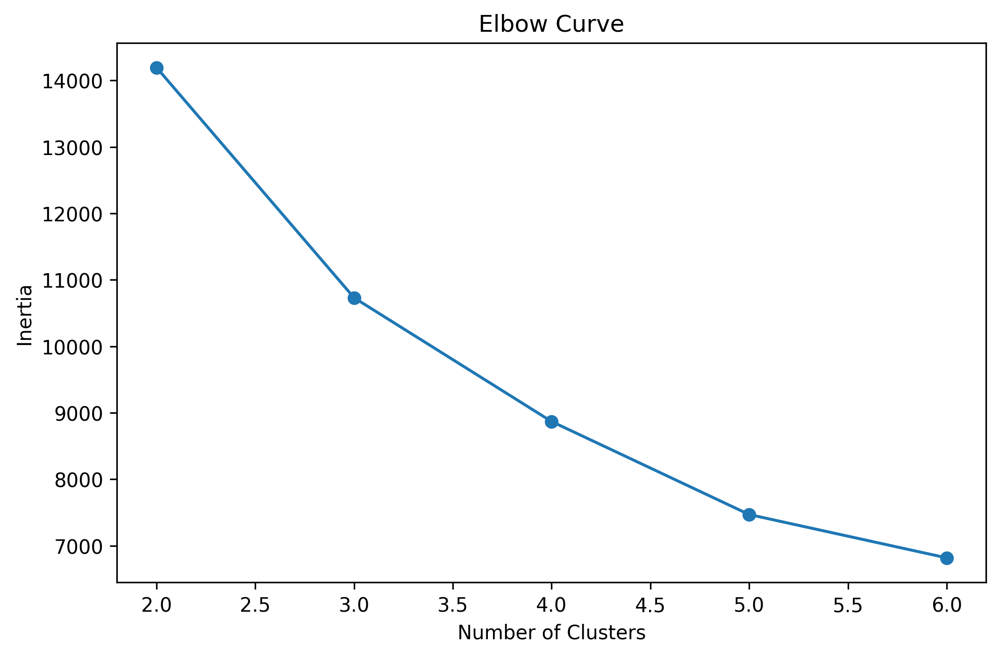
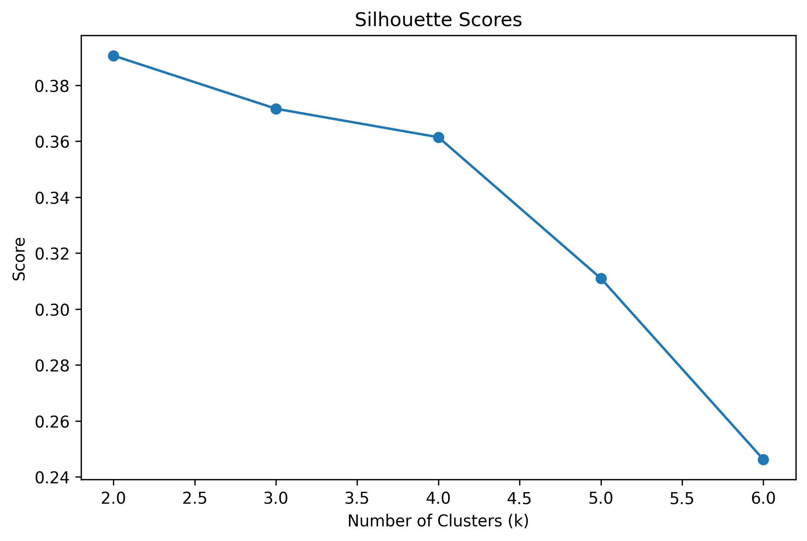
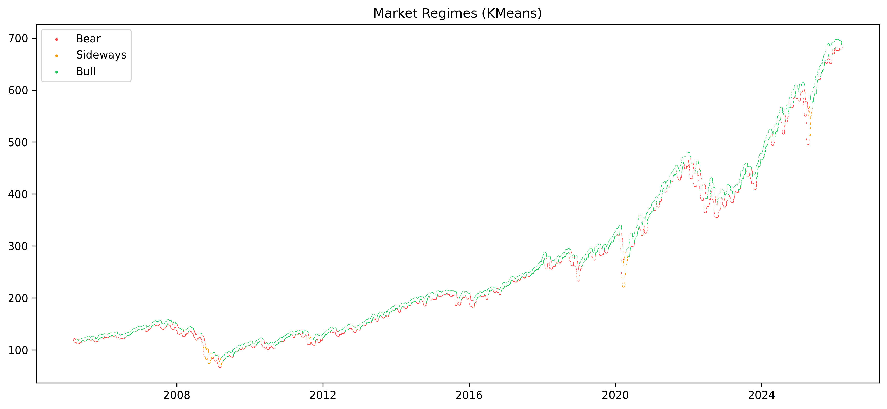

# Market Regime Detection System

## Overview

Financial markets do not behave uniformly over time. Instead, they cycle through **distinct regimes** characterized by different volatility, momentum, and return behavior.

This project builds an **unsupervised machine learning pipeline** to detect **market regimes** in the S&P 500 ETF (**SPY**) using historical price data from **2005–present**.

The system identifies three primary regimes:

- **Bull** - trending upward markets  
- **Bear** - declining markets  
- **Sideways** - range-bound or uncertain markets  

Two models are implemented and compared:

- **KMeans Clustering**
- **Gaussian Hidden Markov Model (HMM)**

---

# Dataset

- **Asset:** SPY (S&P 500 ETF)  
- **Source:** Yahoo Finance (`yfinance`)  
- **Frequency:** Daily  
- **Start Date:** 2005  
- **Observations:** ~5200 trading days  

SPY is used as a proxy for the **broader U.S. equity market**, capturing major events such as:

- 2008 Global Financial Crisis  
- 2020 COVID crash  
- 2022 rate-hike selloff  

---

# Feature Engineering

Four domain-motivated features are used to characterize market behavior.

| Feature | Description |
|------|------|
| Rolling Volatility (20d) | Risk proxy capturing volatility clustering |
| SMA Ratio (20/50) | Trend indicator |
| RSI (14) | Momentum oscillator |
| Log Return (5d) | Short-term directional signal |

All features are **standardized using StandardScaler** before clustering.

---

# Model Methodology

## KMeans Clustering

KMeans is used as the **primary unsupervised model**.

Since cluster labels are arbitrary, regimes are assigned **post-clustering** based on **mean return ranking**:

```
Lowest mean return  → Bear
Middle mean return  → Sideways
Highest mean return → Bull
```

---

## Hidden Markov Model (HMM)

A **Gaussian HMM** is used to capture **temporal dependence between regimes**.

Observation space:

```
[log_return, rolling_volatility]
```

This allows the model to estimate **transition probabilities between regimes**, reflecting the persistence of market states.

---

# Choosing the Number of Clusters

Two techniques were used to justify **k = 3**.

## Elbow Curve

<p align="center">
  
</p>

The elbow method shows diminishing returns in inertia reduction beyond **k = 3**.

---

## Silhouette Analysis

<p align="center">
  
</p>

Silhouette scores were evaluated for **k = 2–6**.

The highest score occurred at **k = 3 (~0.37)**, indicating the best balance between cluster cohesion and separation.

---

# Market Regime Detection

<p align="center">
  
</p>

The regime visualization highlights key historical periods:

- **2008 Financial Crisis → Bear**
- **2013–2019 → Bull**
- **2020 COVID crash → Bear**
- **2022 Rate Hike Selloff → Bear**

---

# Project Structure

```
market-regime-detection
│
├── src
│   ├── data.py
│   ├── features.py
│   ├── model.py
│   ├── train.py
│   └── visualize.py
│
├── notebooks
│   ├── 01_eda_preprocessing.ipynb
│   └── 02_model_training.ipynb
│
├── models
│   ├── kmeans_model.pkl
│   ├── hmm_model.pkl
│   └── scaler.pkl
│
├── outputs
│   ├── regime_results.csv
│   └── visualization images
```

---

# How to Run

### Install dependencies

```
pip install -r requirements.txt
```

### Train models

```
python -m src.train
```

### Explore notebooks

```
notebooks/01_eda_preprocessing.ipynb
notebooks/02_model_training.ipynb
```

---

# Key Takeaways

- Market regimes can be identified using **unsupervised learning**
- Volatility and momentum features strongly separate regimes
- **HMM captures temporal persistence**, improving regime continuity
- Combining clustering and probabilistic models provides **more robust regime analysis**

---

# Future Improvements

Possible extensions include:

- Adding macroeconomic indicators (VIX, interest rates)
- Using **Hidden Semi-Markov Models**
- Regime-based **portfolio allocation strategies**

---

# Technologies Used

- Python
- Scikit-Learn
- hmmlearn
- Pandas
- NumPy
- Matplotlib
- Plotly
- yfinance

---

# Author

Disha Patel  
Computer Science Student | Machine Learning & Quant Finance
